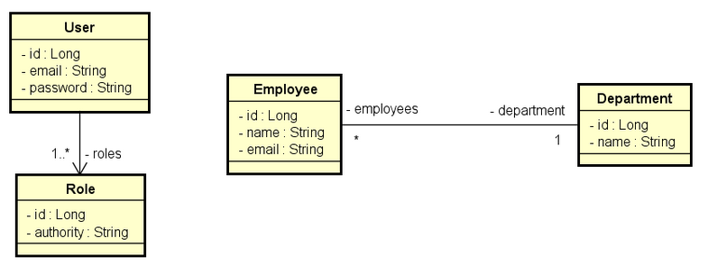

# Gerenciamento de Funcionários

## O que é?

API para gerenciamento de funcionários desenvolvida em **Spring Boot** 2.4.4.

Toda a parte de segurança da API foi feita com **Spring Security** e **OAuth 2**.

Para a geração de access token, foi implementado um **Authorization Server** e um **Resource Server**.

Este projeto foi desenvolvido como resolução de um desafio proposto em um curso: o desafio era desenvolver uma API simples para gerenciamento de funcionários com base nos testes de integração existentes.

## UML



## Usuários:

- *ROLE_OPERATOR*
  - username: ana@gmail.com
  - password: 123456
- *ROLE_ADMIN*
  - username: bob@gmail.com
  - password: 123456

## Regras de negócio:

- Listar funcionários e departamentos requer autenticação como ADMIN ou OPERATOR
- Criar evento e cidade requer autenticação como ADMIN
- Os demais endpoints requerem autenticação como ADMIN ou OPERATOR

## Instalação

Requisitos básicos:

- Java 11
- Maven
- Git

Por possuir o banco de dados H2 (em memória), é possível testar a API sem grandes complicações, bastando testar suas requisições com um software como **Postman** ou **Insomnia**.

1. Clone o repositório:

```
https://github.com/ArthurCech/employees-management-api.git
```

2. Acesse o diretório criado:

```
cd employees-management-api
```

3. Execute o projeto:

```
mvn spring-boot:run
```